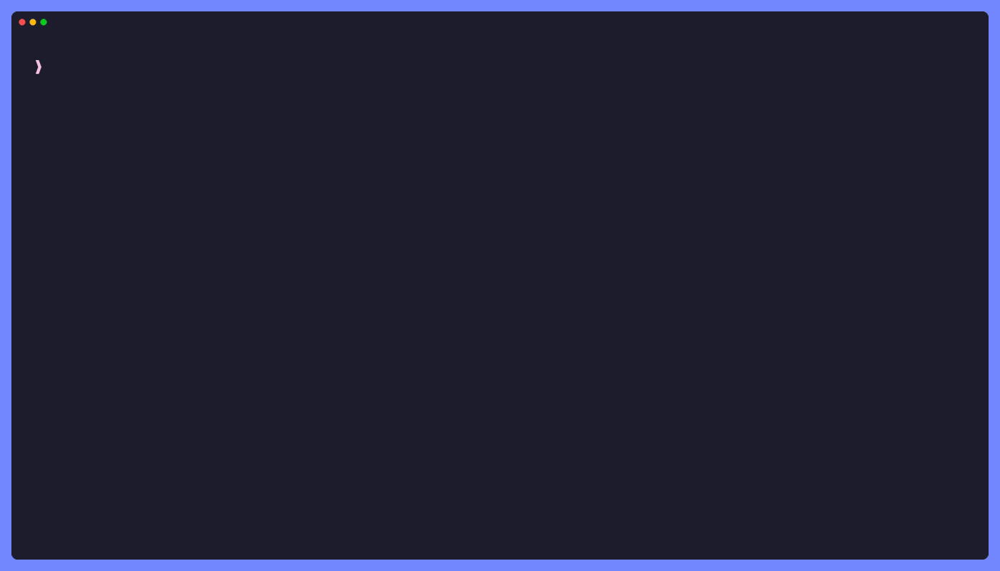

<p align="center">
  <br>
  <a href="https://testless.itaywol.tools" target="_blank" rel="noopener noreferrer">
    
  </a>
  <br>
</p>

<p align="center">Cut your test time to the minimum. Run 5 tests instead of 500 by reading your code, not your coverage.</p>

<div align="center">

[](https://github.com/itaywol/testless/actions/workflows/ci.yml)
[](https://crates.io/crates/testless)
[](https://www.npmjs.com/package/testless-cli)
[](LICENSE)

</div>

<p align="center"><a href="https://testless.itaywol.tools"><b>testless.itaywol.tools</b></a></p>



testless parses your repo into a function-level graph with tree-sitter, diffs
changes structurally (comments and formatting are free), and walks the graph to
find every test a change could break. It prints your runner's own CLI
invocations, ready to execute.

**Selection is always a superset of the truly impacted tests.** testless
widens instead of guessing, and never silently skips a test that could fail.

## Install

| Ecosystem | Command |
|---|---|
| JS / TS | `npm i -D testless-cli` (bin: `testless`) |
| Go | `curl -fsSL https://testless.itaywol.tools/install.sh \| sh` or `brew install itaywol/testless/testless` |
| Rust | `cargo binstall testless` or `cargo install testless` |

Prebuilt binaries on [Releases](https://github.com/itaywol/testless/releases). Nix flake repo: `nix develop`.

## Use

```bash
testless index                                    # build the graph (.testless/)
testless select --from origin/main                # tests impacted by your changes
testless select --from origin/main --format args  # runnable vitest / go test / cargo test lines
```

JSON when piped, human text on a TTY. On fallback-to-everything, `--format args`
prints nothing and exits 2, so branch on the exit code:

```bash
testless select --from origin/main --format args > cmds.txt || RUN_ALL=1
```

## On real repos

| Repo | Change | testless selects |
|---|---|---|
| withastro/astro | a Markdoc transform fix | 6 of 6,121 tests |
| gin-gonic/gin | a panic-recovery fix | 18 of 674 tests |
| openclaw/openclaw | full index: 106,594 tests across 22,797 files | 86s cold, then incremental |

Live recordings of these runs rotate on [the website](https://testless.itaywol.tools).

## Config

Optional `testless.toml` at the repo root, for the cases static inference can't cover:

```toml
always-run = ["tests/smoke/**", "**/*.e2e.test.ts"]  # always select these tests
ignore = ["**/generated/**", "*.pb.go"]               # never index these files
```

## Languages

TypeScript / JavaScript (vitest, jest `-t` patterns) · Go (`go test -run`) · Rust (`cargo test`)

A new language is roughly one plugin file: see [CONTRIBUTING](CONTRIBUTING.md).

## Status

Young project. The selection engine works end to end on all three languages;
precision improves release by release. Roadmap lives in
[issues](https://github.com/itaywol/testless/issues).

[MIT](LICENSE)
